# NeXa RoVe

A personal local-first AI and robotics project exploring voice interaction, visual feedback, Raspberry Pi hardware, sensors and robotics experiments.


## Start here

This README is the guided tour for NeXa RoVe. It is designed to help a recruiter, engineer or project reviewer move through the project in a clear order: what it is, what I am building, what I have learned, what hardware is involved, how the system works and which examples can be explored.

<table>
  <tr>
    <td>
      <h3>Open the visual project tour</h3>
      <p>A static dark-mode project experience with the NeXa face controller, animated panels, gallery, video, hardware tour, code lab, calendar and mini game.</p>
      <p>
        <a href="index.html">
          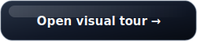
        </a>
      </p>
      <sub>For the live hosted version, enable GitHub Pages from the repository root. The same <code>index.html</code> becomes the visual tour entry point.</sub>
    </td>
  </tr>
</table>

<table>
  <tr>
    <td width="25%">
      <h3>System design</h3>
      <p>Understand the runtime shape, command flow and assistant pipeline.</p>
      <a href="docs/system-design-overview.md">
        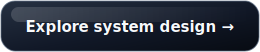
      </a>
    </td>
    <td width="25%">
      <h3>Command flow</h3>
      <p>See how spoken or typed input becomes an assistant response.</p>
      <a href="diagrams/command-understanding.md">
        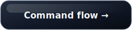
      </a>
    </td>
    <td width="25%">
      <h3>Physical build</h3>
      <p>Review the Raspberry Pi, display, sensors, cameras and mobile base.</p>
      <a href="hardware/hardware-overview.md">
        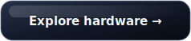
      </a>
    </td>
    <td width="25%">
      <h3>Example code</h3>
      <p>Run small Python files that explain the main design ideas.</p>
      <a href="examples/public_demo/">
        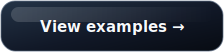
      </a>
    </td>
  </tr>
  <tr>
    <td width="25%">
      <h3>Gallery</h3>
      <p>See the current physical setup and selected build images.</p>
      <a href="media/images/gallery.md">
        
      </a>
    </td>
    <td width="25%">
      <h3>Diagrams</h3>
      <p>Follow the runtime, vision, model and hardware safety diagrams.</p>
      <a href="diagrams/README.md">
        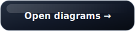
      </a>
    </td>
    <td width="25%">
      <h3>Engineering story</h3>
      <p>Read the build journey, decisions, challenges and progress notes.</p>
      <a href="docs/engineering-story.md">
        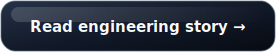
      </a>
    </td>
    <td width="25%">
      <h3>Demo</h3>
      <p>Watch a short video of the current NeXa RoVe setup.</p>
      <a href="media/videos/nexa-rove-26s-demo.mp4">
        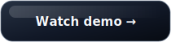
      </a>
    </td>
  </tr>
</table>

## What is NeXa RoVe?

NeXa RoVe is my personal AI and robotics project. I am using it to learn how software, local AI, voice interaction, UI feedback and real hardware can work together.

The project combines a local assistant direction, a Visual Shell interface, Raspberry Pi hardware, sensors, cameras and robotics experiments. It started as an assistant idea and grew into a broader engineering project about runtime design, hardware integration, feedback, testing and documentation.

It is active development, not a finished commercial product. The value of the project is the process: building pieces, testing them on real hardware, finding weak points, fixing them and documenting what I learned.

## What I am trying to build

I am working toward an assistant that can listen, respond and show what it is doing. The screen matters because voice systems can feel unclear when they are silent, slow or unsure. The Visual Shell gives the assistant a place to show status, thinking, responses, panels and system feedback.

I am also building a hardware platform for experiments with sensors, cameras and movement. The goal is not just to make a chatbot on wheels. The interesting part is how a local assistant can understand requests, explain its state, use nearby hardware and stay careful around physical actions.

The direction is local-first where it makes sense. Some tasks should be quick deterministic commands. Some can use small local model responses. Some need helper flows, safety checks or a clearer question from the user.

NeXa RoVe also includes learning support ideas: study help, explanations, quizzes, plans and routines. I am treating it as a serious engineering project built through iteration, tests and documentation rather than a one-off demo.

## What I am learning

The project touches several areas at once, which is what makes it useful as a learning project. Each part has taught me something different about building software that has to interact with people and real hardware.

- System design for assistant-style applications
- Python runtime structure and small testable modules
- Local AI trade-offs and model routing ideas
- Speech interaction, wake/listen behavior and command recovery
- Command understanding and fallback design
- UI feedback for listening, thinking, responding and blocked states
- Godot interface work for a physical assistant screen
- Raspberry Pi hardware integration
- Camera and sensor reliability
- Robotics safety thinking for movement requests
- Testing, debugging and live verification
- Technical documentation that explains design decisions clearly

## See the physical build

The gallery is the first visual stop in the tour. It shows the current NeXa RoVe setup, the front display and the internal hardware layout without putting a huge image at the top of the README.

<p align="center">
  
</p>
<p align="center"><sub>Current NeXa RoVe setup.</sub></p>

<table>
  <tr>
    <td width="50%" align="center">
      <br>
      <sub>Front view of the current build.</sub>
    </td>
    <td width="50%" align="center">
      <br>
      <sub>Visual Shell running on the front display.</sub>
    </td>
  </tr>
  <tr>
    <td width="50%" align="center">
      <br>
      <sub>Top view showing mounting and build progress.</sub>
    </td>
    <td width="50%" align="center">
      <br>
      <sub>Inside view of the hardware layout.</sub>
    </td>
  </tr>
</table>

<p align="center">
  <a href="media/images/gallery.md">
    
  </a>
</p>

## Hardware used

The hardware gives the project a real environment to work against. Devices can be missing, slow, noisy or unreliable, so the software has to report state clearly and behave conservatively.

<table>
  <tr>
    <td width="25%" align="center">
      <br>
      <b>Raspberry Pi 5</b><br>
      <sub>Main local computer used for development, integration and running the project on real hardware.</sub>
    </td>
    <td width="25%" align="center">
      <br>
      <b>AI HAT+</b><br>
      <sub>Used while exploring local AI and vision acceleration ideas.</sub>
    </td>
    <td width="25%" align="center">
      <br>
      <b>8 inch DSI display</b><br>
      <sub>Shows assistant feedback, status panels and interface screens.</sub>
    </td>
    <td width="25%" align="center">
      <br>
      <b>ReSpeaker microphone</b><br>
      <sub>Used for voice input experiments and local interaction work.</sub>
    </td>
  </tr>
  <tr>
    <td width="25%" align="center">
      <br>
      <b>Camera Module 3 Wide</b><br>
      <sub>Used for camera feedback and vision experiments.</sub>
    </td>
    <td width="25%" align="center">
      <br>
      <b>OAK-D Lite</b><br>
      <sub>Used while exploring depth and vision hardware options.</sub>
    </td>
    <td width="25%" align="center">
      <br>
      <b>6x4 mobile base</b><br>
      <sub>Physical base for movement experiments and safety thinking.</sub>
    </td>
    <td width="25%" align="center">
      <br>
      <b>Pan-tilt hardware</b><br>
      <sub>Used for camera positioning and movement experiments.</sub>
    </td>
  </tr>
  <tr>
    <td width="25%" align="center">
      <br>
      <b>ToF sensor</b><br>
      <sub>Used for distance and nearby-object sensing experiments.</sub>
    </td>
    <td width="25%" align="center">
      <br>
      <b>BME688 sensor</b><br>
      <sub>Used for environment and status sensing experiments.</sub>
    </td>
    <td width="25%" align="center">
      <br>
      <b>Orientation sensor</b><br>
      <sub>Used while exploring motion and orientation awareness.</sub>
    </td>
    <td width="25%" align="center">
      <br>
      <b>Power / UPS hardware</b><br>
      <sub>Supports power work for the physical build.</sub>
    </td>
  </tr>
  <tr>
    <td width="25%" align="center">
      <br>
      <b>SSD</b><br>
      <sub>Local storage used during development and testing.</sub>
    </td>
    <td width="25%" align="center">
      <br>
      <b>Speaker</b><br>
      <sub>Used for local audio output experiments.</sub>
    </td>
    <td width="25%" align="center">
      <br>
      <b>USB hub</b><br>
      <sub>Helps connect and test multiple devices during development.</sub>
    </td>
    <td width="25%" align="center">
      <br>
      <b>I2C expansion board</b><br>
      <sub>Used while exploring connected sensor layouts.</sub>
    </td>
  </tr>
</table>

<p align="center">
  <a href="hardware/hardware-overview.md">
    
  </a>
</p>

## How NeXa RoVe works

The rough flow is:

**Voice or text input -> command understanding -> assistant decision -> visual or spoken feedback -> optional hardware action -> testing and improvement loop**

**Voice or text input** starts the interaction. A typed message and a spoken phrase can follow the same broad path once the text is prepared.

**Command understanding** decides whether the request looks like a status command, learning request, camera request, movement request, general question or unclear input.

**Assistant decision** chooses the next step. Some requests are deterministic. Some need a local response path. Some should ask a follow-up question. Hardware requests need extra checks.

**Visual or spoken feedback** makes the assistant easier to understand. The interface can show listening, thinking, responding, blocked, learning and hardware-check states.

**Optional hardware action** only makes sense after checks. Movement and sensing work should default to waiting or stopping when the state is uncertain.

**Testing and improvement** is a constant loop. The project has grown through small fixes, reports, focused tests and live hardware checks.

## Diagram tour

These diagrams are the fastest way to understand the system shape. Start with the runtime pipeline, then move into command understanding, vision, local model routing and hardware safety.

<table>
  <tr>
    <td width="25%">
      <h3>Runtime pipeline</h3>
      <p>How input moves through the assistant flow.</p>
      <a href="diagrams/runtime-pipeline.md">
        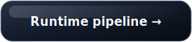
      </a>
    </td>
    <td width="25%">
      <h3>Command understanding</h3>
      <p>How commands and fallback paths are separated.</p>
      <a href="diagrams/command-understanding.md">
        
      </a>
    </td>
    <td width="25%">
      <h3>Vision flow</h3>
      <p>How camera and detection ideas fit into the system.</p>
      <a href="diagrams/vision-flow.md">
        
      </a>
    </td>
    <td width="25%">
      <h3>Hardware safety</h3>
      <p>How movement ideas are checked before action.</p>
      <a href="diagrams/hardware-safety-loop.md">
        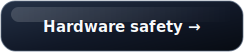
      </a>
    </td>
  </tr>
  <tr>
    <td width="25%">
      <h3>Local AI model flow</h3>
      <p>How local response routes can be selected by task type.</p>
      <a href="diagrams/local-ai-model-flow.md">
        
      </a>
    </td>
    <td width="25%">
      <h3>Visual Shell flow</h3>
      <p>How UI state helps explain what the assistant is doing.</p>
      <a href="diagrams/visual-shell-flow.md">
        
      </a>
    </td>
    <td width="25%">
      <h3>Build stage map</h3>
      <p>How the project has moved through stages.</p>
      <a href="diagrams/build-stage-map.md">
        
      </a>
    </td>
    <td width="25%">
      <h3>System overview</h3>
      <p>A readable overview of the design direction.</p>
      <a href="docs/system-design-overview.md">
        
      </a>
    </td>
  </tr>
</table>

## Engineering journey

NeXa RoVe has been built through many small iterations. I worked through voice issues, runtime design, UI feedback, hardware testing, sensors, cameras, robotics safety and documentation. Real hardware made the work harder because devices can be missing, slow, noisy or unreliable.

I used reports, tests and small focused improvements to keep the project moving. The project is as much about engineering judgment as it is about features: deciding what to test, what to simplify, what to show on screen and when the system should wait instead of acting.

<table>
  <tr>
    <td width="20%">
      <h3>Engineering story</h3>
      <p>A readable account of the project direction and build process.</p>
      <a href="docs/engineering-story.md">
        
      </a>
    </td>
    <td width="20%">
      <h3>Build map</h3>
      <p>Project stages and how the pieces connect over time.</p>
      <a href="docs/build-map.md">
        
      </a>
    </td>
    <td width="20%">
      <h3>Challenges</h3>
      <p>Problems I worked through and how I approached them.</p>
      <a href="docs/challenges-and-solutions.md">
        
      </a>
    </td>
    <td width="20%">
      <h3>Engineering log</h3>
      <p>Selected progress notes and project updates.</p>
      <a href="reports/public-engineering-log.md">
        
      </a>
    </td>
    <td width="20%">
      <h3>Technical brief</h3>
      <p>A recruiter-friendly summary of the engineering work.</p>
      <a href="docs/recruiter-technical-brief.md">
        
      </a>
    </td>
  </tr>
</table>

## Explore the example code

The example files are small runnable Python files that show the main design ideas in a simple form. They use fake data and the Python standard library, so they can be read, run and tested without the full hardware setup.

This is the best place to try the ideas directly. Start with the system flow, then look at command understanding, runtime routing, hardware safety, vision confidence, UI state, model route selection and learning flow.

<table>
  <tr>
    <td width="25%">
      <h3>System flow</h3>
      <p>Shared command classification and movement decision idea.</p>
      <a href="examples/public_demo/system_flow_example.py">
        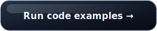
      </a>
    </td>
    <td width="25%">
      <h3>Command understanding</h3>
      <p>Classifies status, hardware, learning, camera and movement commands.</p>
      <a href="examples/public_demo/command_understanding_example.py">
        
      </a>
    </td>
    <td width="25%">
      <h3>Runtime pipeline</h3>
      <p>Runs voice and text through the same simplified response flow.</p>
      <a href="examples/public_demo/runtime_pipeline_example.py">
        
      </a>
    </td>
    <td width="25%">
      <h3>Hardware safety gate</h3>
      <p>Shows ALLOW, WAIT, STOP and BLOCKED decisions from fake state.</p>
      <a href="examples/public_demo/hardware_safety_gate_example.py">
        
      </a>
    </td>
  </tr>
  <tr>
    <td width="25%">
      <h3>Vision confidence</h3>
      <p>Uses fake detections to show confidence and freshness checks.</p>
      <a href="examples/public_demo/vision_confidence_example.py">
        
      </a>
    </td>
    <td width="25%">
      <h3>UI state</h3>
      <p>Maps assistant events to visible interface states.</p>
      <a href="examples/public_demo/ui_state_example.py">
        
      </a>
    </td>
    <td width="25%">
      <h3>Local model route</h3>
      <p>Shows a simple route choice between commands, local responses and helpers.</p>
      <a href="examples/public_demo/local_model_route_example.py">
        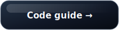
      </a>
    </td>
    <td width="25%">
      <h3>Learning flow</h3>
      <p>Maps learning phrases to lesson, quiz, plan and explanation modes.</p>
      <a href="examples/public_demo/learning_flow_example.py">
        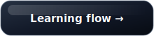
      </a>
    </td>
  </tr>
</table>

## Run the examples

```bash
python3 examples/public_demo/system_flow_example.py
python3 examples/public_demo/command_understanding_example.py
python3 examples/public_demo/runtime_pipeline_example.py
python3 examples/public_demo/hardware_safety_gate_example.py
python3 examples/public_demo/vision_confidence_example.py
python3 examples/public_demo/ui_state_example.py
python3 examples/public_demo/local_model_route_example.py
python3 examples/public_demo/learning_flow_example.py
```

Run the example tests:

```bash
python3 -m unittest discover examples/public_demo -p "test_*.py"
```

<p align="center">
  <a href="docs/code-examples.md">
    
  </a>
</p>

## Short demo video

The demo shows the current physical setup and the direction of the interface on the front display.

<p align="center">
  <a href="media/videos/nexa-rove-26s-demo.mp4">
    
  </a>
</p>

## Public boundaries

This public repository is designed to show my work on NeXa RoVe in a controlled way. The main working repository remains private for now, but this repo explains the project, hardware, design thinking, diagrams, simplified examples and selected progress.

This public repository does not include private source code, prompts, memory files, logs, diagnostics, raw recordings, private configuration or the full internal runtime.

See [docs/public-boundaries.md](docs/public-boundaries.md) and [docs/what-can-be-shown-publicly.md](docs/what-can-be-shown-publicly.md) for the public sharing rules I am using.
