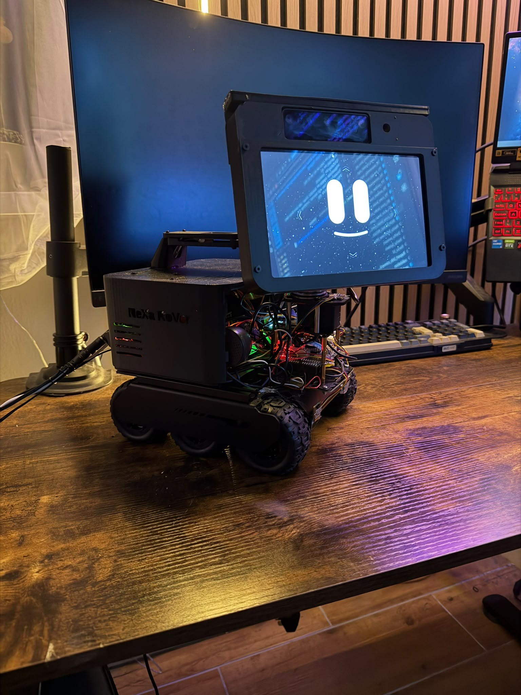
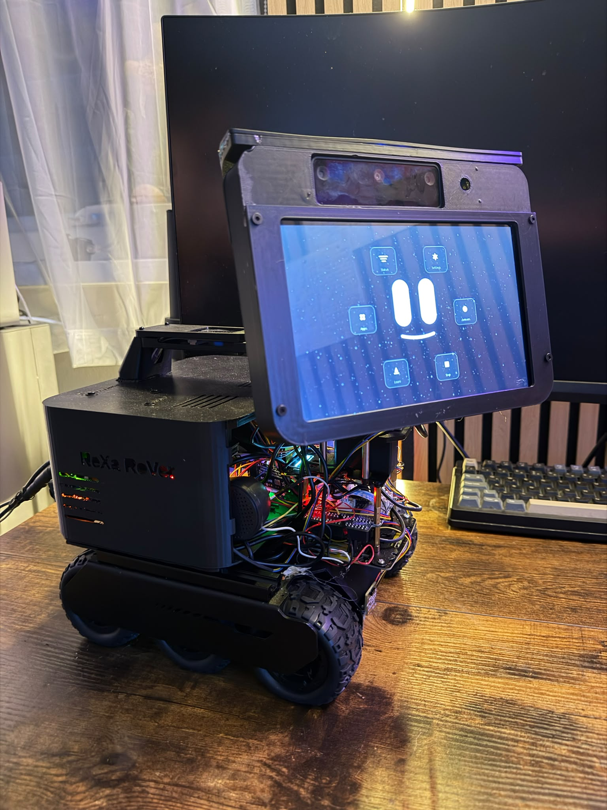
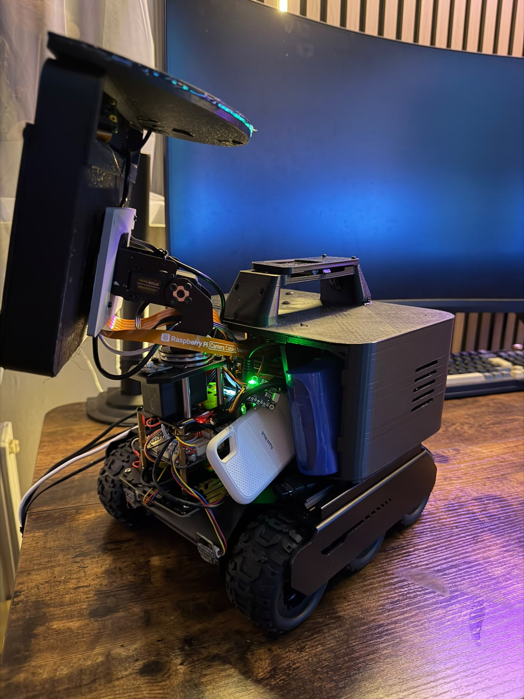
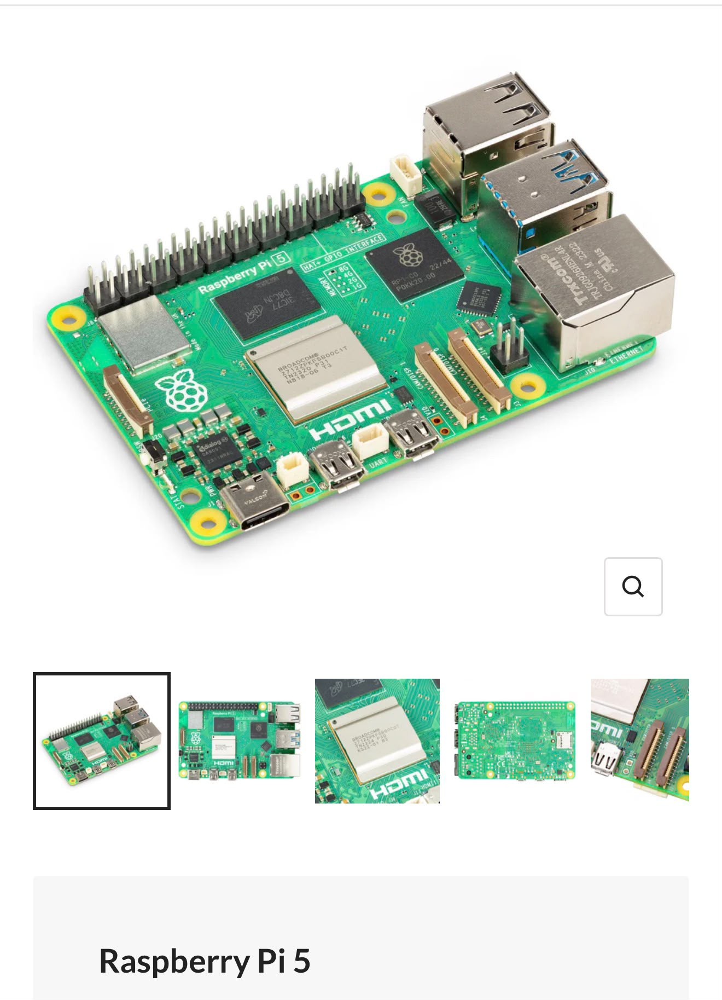

# NeXa RoVe

This is the public project page for NeXa RoVe, my personal AI and robotics project.

NeXa RoVe is an active project I am building step by step. It explores how a local-first assistant could work with voice interaction, a visual interface, Raspberry Pi hardware, sensors, and careful robotics control.

## Project photos

### NeXa RoVe

Current public-safe view of the NeXa RoVe setup.

Visual interface running on the front display with safe public content.

### Hardware

Hardware components used for local AI, sensing, interface work, and robotics experiments.

Raspberry Pi hardware used as part of the local-first development direction.

More images are available in [media/images/gallery.md](media/images/gallery.md).

## Short demo video

[Watch the 26-second NeXa RoVe demo](media/videos/nexa-rove-26s-demo.mp4)

## What I am building

NeXa RoVe is an experimental assistant and robotics system. The aim is to make an assistant that can listen, respond, show useful information on a screen, and connect to physical hardware in a controlled way.

It is not presented as a finished product. I am using this public repository to explain the project clearly, share safe progress updates, and show selected public material as the build develops.

## Why I am building it

Most AI assistants depend heavily on cloud services. That can be useful, but it also raises questions about privacy, reliability, cost, and control.

NeXa RoVe explores a more local-first direction. The goal is to understand how much useful assistant behaviour can happen close to the user, on local hardware, while still keeping the system understandable and safe.

I am also interested in how this kind of system could support learning, routines, memory, and practical everyday help without needing to expose private information unnecessarily.

## What the project explores

- Voice interaction for a physical assistant
- Local AI and local speech tools
- A visual shell for status, feedback, and interaction
- Raspberry Pi based hardware integration
- Sensors, displays, microphones, and robotics hardware
- Safe command handling for physical systems
- Testing and debugging on real hardware

## Current work

I am currently working on the foundations of the project:

- local voice interaction
- assistant feedback through a visual interface
- Raspberry Pi hardware integration
- sensors and robotics exploration
- safe physical interaction
- a local-first AI direction
- testing, debugging, and improving reliability
- learning support and personal assistance ideas

The current focus is not to claim that everything is complete. It is to build, test, document, and improve the system in small practical steps.

More detail is available in [docs/current-work.md](docs/current-work.md) and [docs/current-stage.md](docs/current-stage.md).

## Technologies

At a high level, the project uses:

- Python
- Raspberry Pi hardware
- local speech and AI tools
- local text-to-speech
- camera and sensor work
- UI and display work
- testing and diagnostic tooling

The full private development system is not included in this repository.

## Public updates

This repository will contain safe public material such as:

- project overview notes
- selected progress logs
- hardware and software summaries
- safe diagrams
- demo plans
- screenshots and videos that do not show private data
- simplified example code

See [docs/public-boundaries.md](docs/public-boundaries.md) and [docs/what-can-be-shown-publicly.md](docs/what-can-be-shown-publicly.md) for the public sharing rules I am using.

## Safe example code

Safe simplified code examples are available in [examples/public_demo](examples/public_demo). They show public concepts only, such as voice activity, speech flow, mocked sensors, detection, follow-me safety decisions, and time intent handling. They do not include private NeXa runtime code.

## Safety note

This repository does not include private source code, secrets, prompts, memory files, logs, diagnostics, raw audio, raw camera images, transcripts, private configuration, or the full internal architecture of the working system.
