# Build stage map

This diagram shows how the project grew from an assistant idea into a hardware and robotics project.

```mermaid
flowchart LR
    concept[Concept] --> runtime[Local runtime]
    runtime --> voice[Voice interaction]
    voice --> commands[Command understanding]
    commands --> shell[Visual Shell]
    shell --> hardware[Raspberry Pi hardware]
    hardware --> sensing[Sensors and cameras]
    sensing --> robotics[Robotics experiments]
    robotics --> learn[Learning support]
    learn --> public[Public repo and demos]
```

## Explanation

The project did not appear as one finished system. It grew through small stages, each introducing new problems.

## Design notes

- Runtime structure came before more complex features.
- Voice and UI changed how the assistant needed to communicate state.
- Hardware introduced real-world failure cases.
- Robotics made safety checks more important.
- Public documentation helped turn the work into a clear portfolio.

## Why this matters

The build history shows the engineering process: start with a useful idea, add one layer at a time, test it, document what changed and keep improving.
