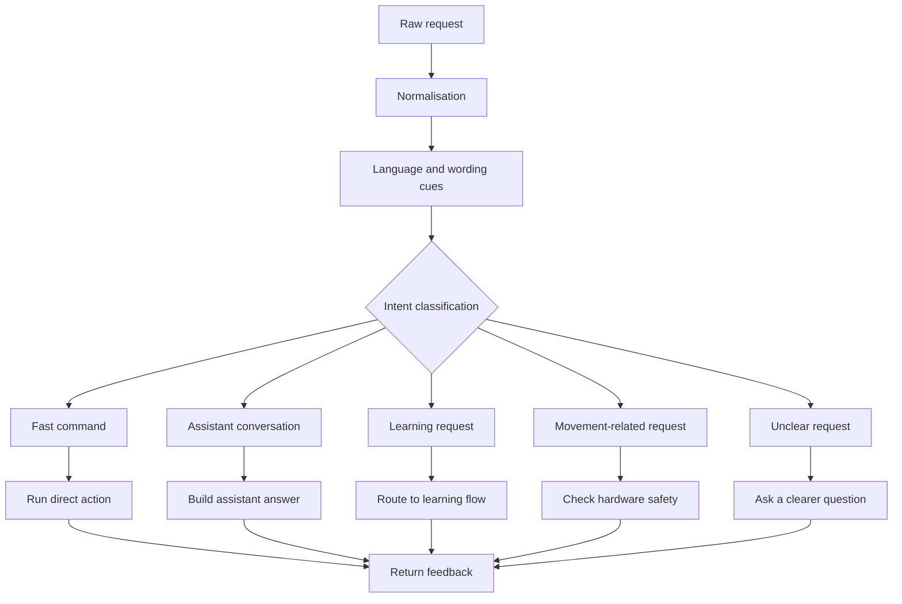

# Command understanding

Command understanding is the part that decides what kind of request the user has made.

## Explanation

The assistant should not treat every sentence the same way. A request for the time, a learning question, a UI command and a movement request all need different handling.

## Design notes

- Keep simple commands fast.
- Ask for clarification when the request is unclear.
- Route learning requests into a structured learning flow.
- Send movement-related requests through an extra check before action.

## Why this matters

Good command understanding makes the assistant feel more reliable. It also prevents a normal conversation request from accidentally being treated like a hardware instruction.
