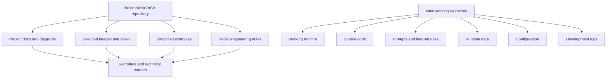

# Data and repository boundaries

This is the dedicated boundary diagram for the public repository.

## Explanation

The public repository is a portfolio and project explanation. The main working repository is where the full development system lives.

## Design notes

- The public repo shows the project, diagrams, selected media and simplified examples.
- The working repo keeps full source code, detailed runtime behaviour and live development data.
- This split lets the project be understandable without publishing everything.

## Why this matters

NeXa RoVe involves voice, hardware, robotics and personal-assistant ideas. A controlled public repository is the right way to share the work while keeping the working system separate.
