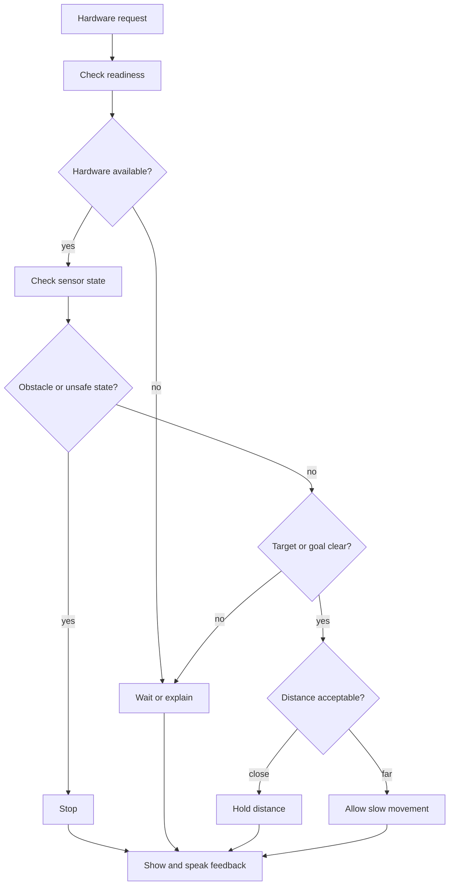

# Hardware safety loop

Hardware actions are handled differently from normal text responses.

## Explanation

The safety loop turns movement into a decision problem. The assistant checks readiness, sensor state, obstacles, target confidence and distance before deciding what to do.

## Design notes

- Stop is a valid outcome.
- Waiting is better than guessing.
- Slow movement should require clear conditions.
- Feedback should explain why action was blocked or allowed.

## Why this matters

Physical systems need more care than screen-only software. A wrong text response can be corrected; a wrong movement can create a real problem.
