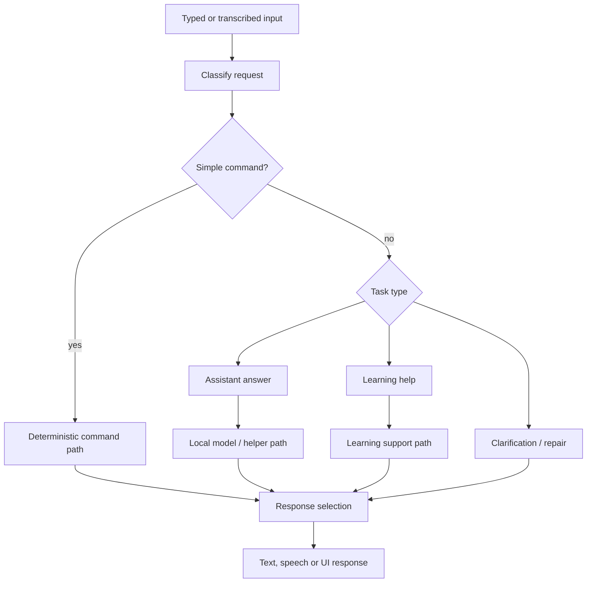

# Local AI and model flow

This diagram shows the broad local AI direction.

## Explanation

Local AI is useful when it gives enough quality at a usable speed. Not every request needs the same path: some commands are better handled directly, while open questions may need model-backed help.

## Design notes

- Fast commands should stay fast.
- Local models are useful for suitable tasks.
- Clarification is better than guessing when the input is weak.
- The interface should show progress during slower work.

## Why this matters

Local AI on small hardware is a tradeoff between speed, quality and reliability. Designing the flow carefully helps the assistant stay usable.
