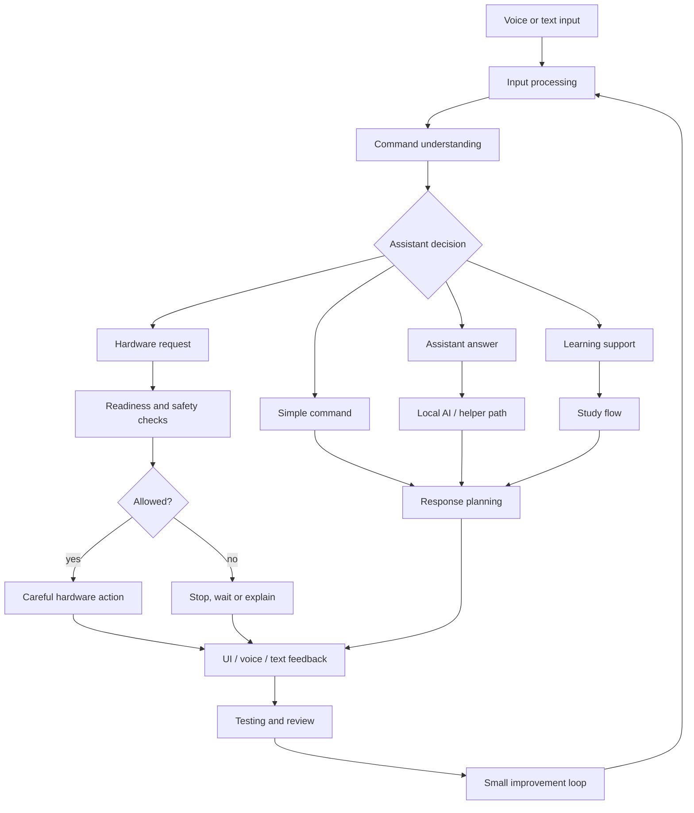

# Runtime pipeline

This diagram shows the main runtime flow behind NeXa RoVe.

The runtime is built around a clear sequence: take input, prepare it, understand it, choose a response path, update the interface and only trigger hardware when the request has passed checks.

## Design notes

- Voice and text should share the same broad understanding path.
- Simple commands should not always need a model.
- UI feedback is part of the runtime, not an afterthought.
- Hardware actions are treated separately from normal answers.

## Why this matters

This structure makes the project easier to test and reason about. It also makes failures easier to isolate because each part has a clear responsibility.
