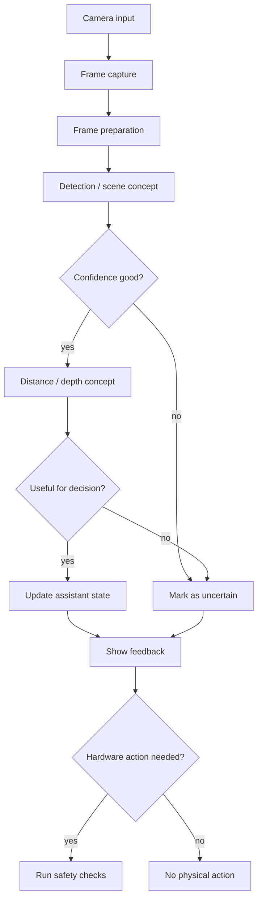

# Vision flow

Vision and sensing are used to explore how the assistant can understand parts of its environment.

## Explanation

The vision flow is designed around input, interpretation, confidence and decisions. A camera reading is useful only when the system can treat it with enough confidence for the task.

## Design notes

- Missing or uncertain vision data should be visible in the interface.
- Confidence matters before any movement decision.
- Vision should support the assistant rather than silently control it.

## Why this matters

Vision work becomes important when the assistant is connected to robotics. The system needs to understand uncertainty before making decisions.
