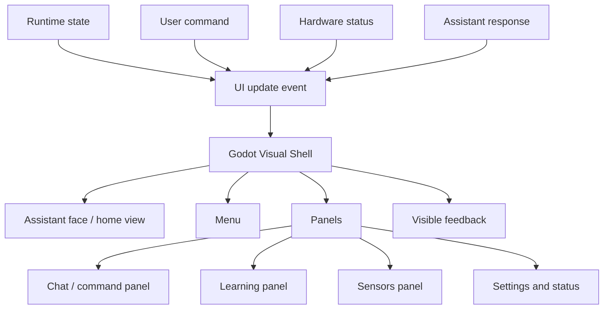

# Visual Shell flow

The Visual Shell is the screen-side interface for NeXa RoVe.

## Explanation

The Visual Shell helps NeXa show state, feedback and panels on the screen. It gives the user something visible to rely on while voice, local processing and hardware work are happening.

## Design notes

- The interface should be calm and readable.
- The face/home view keeps the assistant present.
- Panels should explain state and make actions easier to follow.
- Visual feedback helps when voice processing takes time.

## Why this matters

A physical assistant needs to show what it is doing. Clear visual feedback reduces confusion and makes the system feel more trustworthy.
