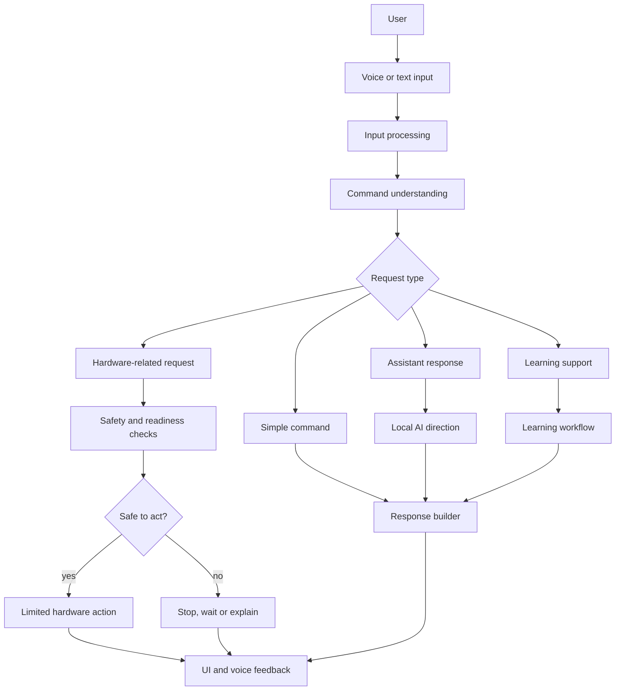
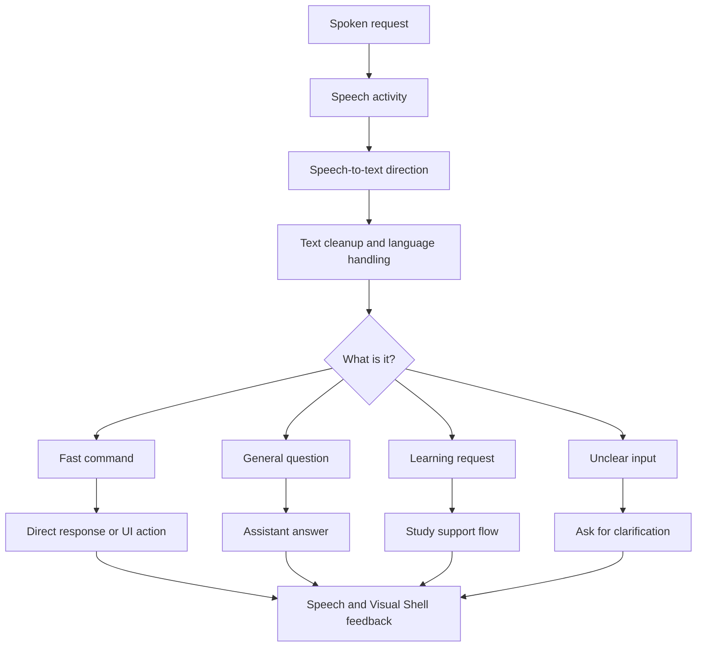
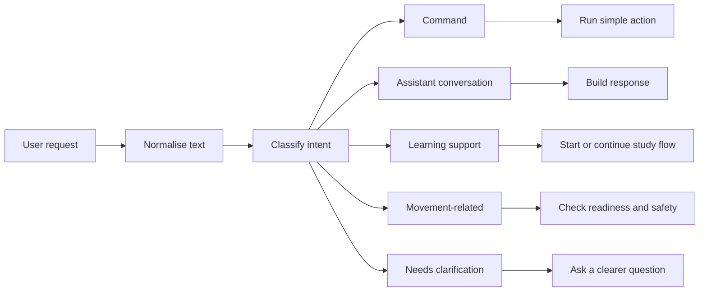
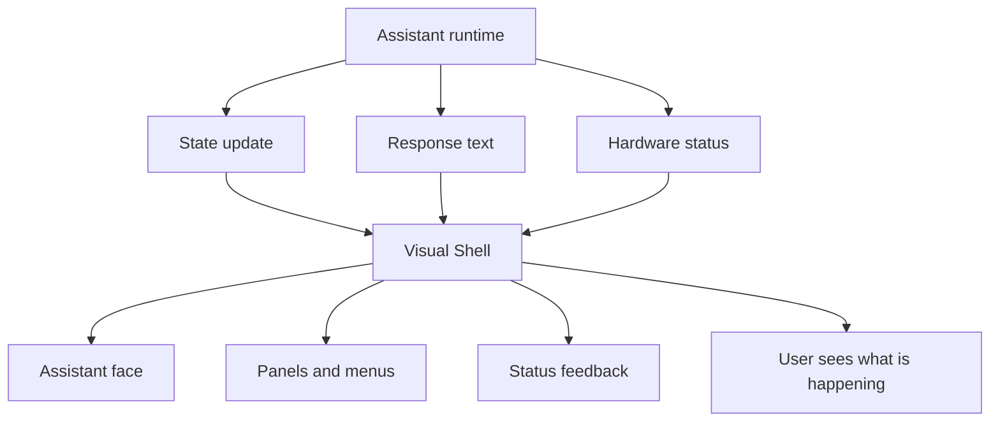
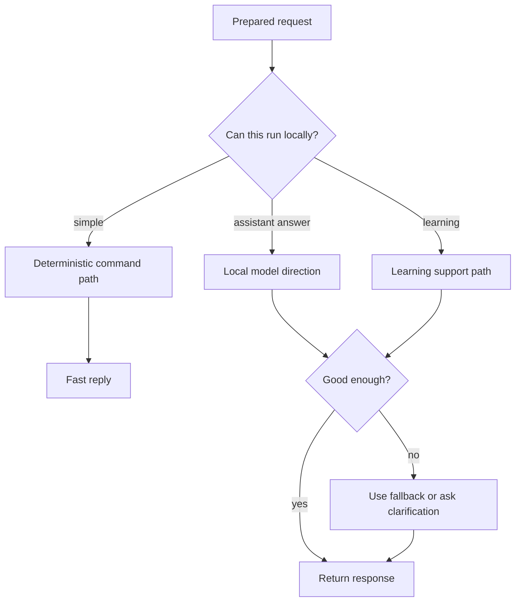
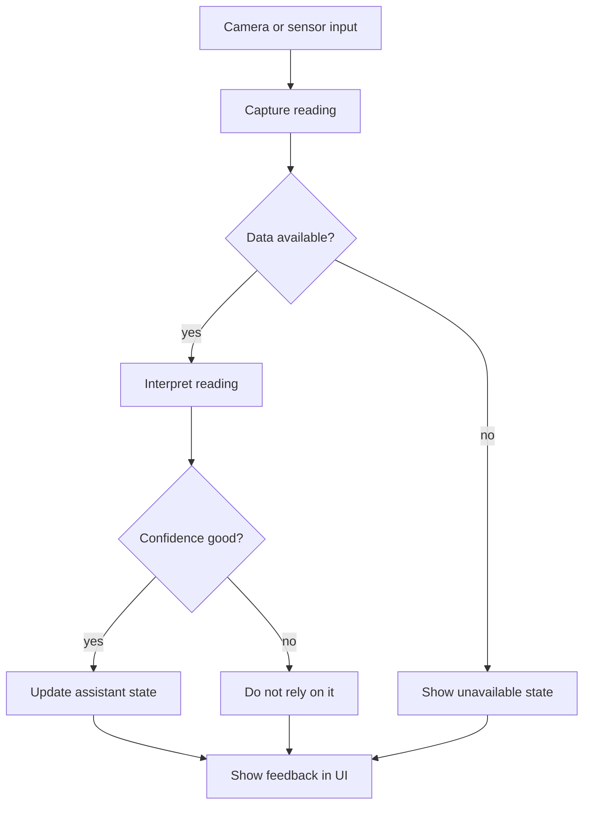
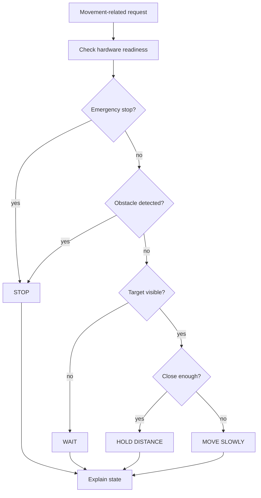
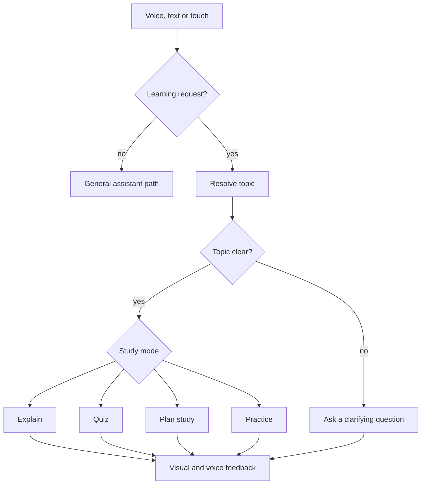

# System diagrams

These diagrams explain the main design ideas behind NeXa RoVe using GitHub Mermaid diagrams.

## Runtime overview

The runtime is designed around a simple idea: prepare the input, understand the request, choose the right path, and give clear feedback. Hardware actions are treated separately because physical movement needs checks before action.

## Voice and command flow

Voice work is not just speech recognition. It involves timing, command understanding, language handling, short confirmations, fallback behaviour and UI feedback.

## Command understanding

The project separates simple commands, assistant conversation, learning support and movement-related requests. That separation keeps the system easier to reason about.

## Visual Shell and UI feedback

The Visual Shell makes the assistant visible. It can show whether NeXa is listening, responding, waiting, showing a panel or reporting hardware state.

## Local AI and model flow

Local-first work is a balancing problem. The project explores where local processing is useful, where it is too slow, and where a simpler deterministic path is better.

## Vision and sensing flow

Camera and sensor data are treated as signals that need checking. The system should show when information is missing or uncertain.

## Robotics movement decision

Movement is handled differently from normal assistant responses. A text answer can be corrected after the fact; a physical action needs careful checks before it happens.

## Learning support flow

The learning direction is about structured support: understanding the request, choosing the right study mode, and giving useful feedback without turning every ordinary question into a study session.
