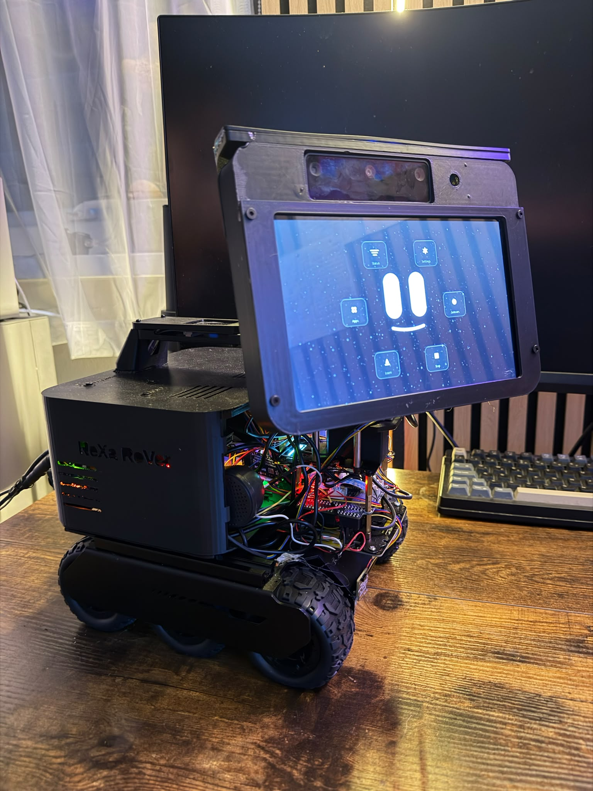

# Image gallery

Selected images from the NeXa RoVe build. The layout keeps one featured image at a readable size, then groups the setup and hardware photos into simple GitHub-friendly tables.

## Featured setup

  

Current NeXa RoVe setup.

## Presentation gallery

<table>
  <tr>
    <td width="50%" align="center">
       
      Front view of the current build.
    </td>
    <td width="50%" align="center">
       
      Visual Shell running on the front display.
    </td>
  </tr>
  <tr>
    <td width="50%" align="center">
       
      Top view showing mounting and build progress.
    </td>
    <td width="50%" align="center">
       
      Inside view of the hardware layout.
    </td>
  </tr>
  <tr>
    <td width="50%" align="center">
       
      Rear view of the current setup.
    </td>
    <td width="50%" align="center">
       
      Front display with menu controls visible.
    </td>
  </tr>
</table>

## Hardware gallery

<table>
  <tr>
    <td width="33%" align="center">
       
      <b>Raspberry Pi 5</b> 
      Main local computer for the project.
    </td>
    <td width="33%" align="center">
       
      <b>AI HAT+</b> 
      Used while exploring local AI and vision acceleration.
    </td>
    <td width="33%" align="center">
       
      <b>8 inch DSI display</b> 
      Screen for assistant feedback and UI panels.
    </td>
  </tr>
  <tr>
    <td width="33%" align="center">
       
      <b>ReSpeaker microphone</b> 
      Voice input hardware for interaction experiments.
    </td>
    <td width="33%" align="center">
       
      <b>Camera Module 3 Wide</b> 
      Camera hardware for vision experiments.
    </td>
    <td width="33%" align="center">
       
      <b>OAK-D Lite</b> 
      Depth and vision hardware explored during the build.
    </td>
  </tr>
  <tr>
    <td width="33%" align="center">
       
      <b>6x4 mobile base</b> 
      Robotics base for movement experiments.
    </td>
    <td width="33%" align="center">
       
      <b>Pan-tilt hardware</b> 
      Movement hardware for camera positioning.
    </td>
    <td width="33%" align="center">
       
      <b>Build preview</b> 
      Side view of the assembled hardware.
    </td>
  </tr>
  <tr>
    <td width="33%" align="center">
       
      <b>BME688 sensor</b> 
      Environment and status sensing.
    </td>
    <td width="33%" align="center">
       
      <b>ToF sensor</b> 
      Distance and nearby-object sensing experiments.
    </td>
    <td width="33%" align="center">
       
      <b>Orientation sensor</b> 
      Motion and orientation awareness.
    </td>
  </tr>
  <tr>
    <td width="33%" align="center">
       
      <b>Power / UPS hardware</b> 
      Power support for the physical build.
    </td>
    <td width="33%" align="center">
       
      <b>SSD storage</b> 
      Local storage for development and testing.
    </td>
    <td width="33%" align="center">
       
      <b>USB hub</b> 
      Connects hardware during development.
    </td>
  </tr>
  <tr>
    <td width="33%" align="center">
       
      <b>Speaker</b> 
      Audio output hardware.
    </td>
    <td width="33%" align="center">
       
      <b>I2C expansion board</b> 
      Used while exploring connected sensors.
    </td>
    <td width="33%" align="center">
       
      <b>Battery hardware</b> 
      Used while testing portable power options.
    </td>
  </tr>
</table>
